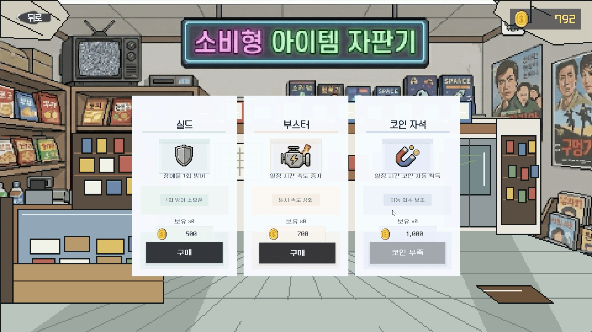

# 👽 자본주E.T. (Capitalist E.T.)

> **"지구에 불시착한 외계인(E.T.), 시대별 경제 격변을 헤쳐나가며 UFO 수리 자금을 모아라!"**  
> **자본주E.T.**는 시대별 경제 이벤트와 금융 선택을 통과하며 미래의 자산 궤적을 직접 바꾸는 **스토리형 브라우저 2D 러너 게임 및 금융 학습 플랫폼**입니다.

<br />

## 🌟 프로젝트 소개
본 프로젝트는 **Unity (클라이언트) + Spring Boot (백엔드) + React (포트폴리오 소개 페이지)**가 긴밀하게 연동된 풀스택 게임 프로젝트입니다.  
유저는 시대별(1980년대, 2000년대, 2020년대) 주행 스테이지에서 장애물을 피하며 코인을 모으고, 돌발적으로 등장하는 경제 퀴즈를 해결하며 금융 지식을 학습합니다. 주행 결과로 축적된 자산은 백엔드 데이터베이스에 실시간으로 연동되어, 자산 증식과 상점 구매, 그리고 궁극적인 목표인 **UFO 수리 자금** 마련으로 이어집니다.

---

## 🔄 핵심 플레이 루프 (Core Loop)


---

## 🎮 실제 플레이 화면 (Gameplay Showcase)

게임플레이 흐름과 서순(Sequence)에 맞추어 구성된 실제 구동 화면입니다.

### 1. 로비 & 스테이지 선택 (Lobby & Stage Selection)
* E.T.가 지구에서 자산 관리 기초를 훈련하고, 시대별 금융 흐름으로 진입하는 로비 및 스테이지 화면입니다.

| 로비 (메인 화면) | 스테이지 선택 |
| :---: | :---: |
|  |  |

<br />

### 2. 시대별 게임 주행 (Era Stages)
* 1980년대 경제 급성장기부터 2000년대 IT 닷컴버블 격변기, 2020년대 고인플레이션/고금리기까지 시대별 맥락이 설계된 2D 러너 맵을 주행합니다. (3열 배치에 맞춰 시연 화면이 잘 보이도록 크게 배치했습니다.)

| 1980년대 (대한민국 급성장기) | 2000년대 (IT 정보화 & 닷컴버블기) | 2020년대 (팬데믹 & 고인플레이션기) |
| :---: | :---: | :---: |
|  |  |  |

<br />

### 3. 인게임 기믹 & 이벤트 (In-Game Gimmicks & Events)
* 주행 중 장애물에 피격되면 카메라가 흔들리며 하트가 차감됩니다. 중간중간 등장하는 군인과 충돌하면 **돌발 퀴즈**가 열리며, 정답을 맞추면 가속 부스터와 방어막을 획득합니다. (퀴즈 창과 정답 결과를 더 자세히 보실 수 있게 크게 정렬했습니다.)

| 장애물 피격 (카메라 셰이크) | 돌발 경제 퀴즈 등장 |
| :---: | :---: |
|  |  |

| 퀴즈 정답 시 보호막 & 속도 부스트 | 게임 오버 (체력 유실) |
| :---: | :---: |
|  |  |

<br />

### 4. 자산 증식 & 정비 (Finance & Goal Achievement)
* 주행 종료 후 번 돈을 시기 적절한 금융 상품(적금/주식 등)에 가입해 굴리고, 상점에서 인게임 아이템을 사거나 우주선을 정비하여 탈출을 가속화합니다. (3열 배치에 맞춰 금융 상품 선택 만기 연출과 상점, 정비 화면을 더 큼직하게 정렬했습니다.)

| 금융 상품 가입 & 자산 증식 결과 | 아이템 상점 구매 | UFO 정비 (최종 목표) |
| :---: | :---: | :---: |
|  |  |  |

---

## 🛠 기술 스택 (Tech Stack)

### Client (Unity)
- **Engine**: Unity (WebGL Build 지원)
- **Language**: C#
- **Key Concepts**: Object Pooling, State Pattern (Animator), Raycast Ground Detection, Dynamic Sound Pitch Modulator, Custom REST API Communication (`APIManager`)

### Backend (Spring Boot)
- **Framework**: Spring Boot 3.5.11
- **Language**: Java 17
- **Database**: PostgreSQL (주 저장소), Redis (세션 및 캐싱)
- **Security**: Spring Security (Session-based Auth), OAuth2 Resource Server, JWT
- **Build Tool**: Gradle 8.x
- **Documentation**: Swagger/OpenAPI 3 (Springdoc)

### Frontend Showcase
- **Framework**: React + Vite
- **Styling**: Modern Vanilla CSS (Sleek Glassmorphism & Responsive Design)
- **Icons**: Lucide React

---

## 📂 디렉토리 구조 (Directory Structure)

```text
zabonzooET/
├── Assets/                 # [Unity] 게임 클라이언트 에셋 및 C# 스크립트
│   ├── Scripts/            # 게임 핵심 로직, API 연동, 퀴즈 및 오디오 제어
│   ├── Sprites/            # 시대별 UI 및 캐릭터 스프라이트 리소스
│   ├── Scenes/             # Lobby, StageSelect, GameStage, FinanceSelect 등
│   └── WebGLTemplates/     # 브라우저 배포용 커스텀 WebGL 템플릿
├── src/                    # [Spring Boot] 백엔드 애플리케이션 소스
│   ├── main/
│   │   ├── java/com/ssafy/amagetdon/
│   │   │   ├── common/     # 글로벌 예외 처리, 웹 설정, 세션 인터셉터
│   │   │   └── domain/     # domain 도메인 핵심 비즈니스 로직 (User, Game, Quiz, Coin)
│   │   └── resources/      # application.yml 설정 및 초기 데이터 SQL
├── portfolio/              # [React] 프로젝트 소개 및 포트폴리오 웹페이지
│   ├── src/                # App.jsx 랜딩 페이지 컴포넌트 및 자산
│   └── package.json        # Node.js 의존성 관리
├── infra/                  # 배포 인프라 및 Docker Compose 환경 설정
└── build.gradle            # Gradle 빌드 스크립트
```

---

## 🚀 주요 기술적 도전 및 해결 (Technical Challenges)

### 1. KDB 공공데이터 기반 동적 퀴즈 생성기 (`QuizDataLoader.java`)
- **문제**: 게임 내 학습 효과를 위해 수많은 금융 용어 퀴즈가 필요했으나, 이를 DB에 수동으로 등록하는 것은 비효율적이었습니다.
- **해결**: 한국산업은행(KDB) 공공데이터 CSV 파일을 파싱하는 **자동 배치 로더**를 구현했습니다. 서버 기동 시 용어 설명문과 정답 단어를 추출하고, 다른 용어 풀에서 무작위로 3개의 오답을 섞어(Shuffle) **4지선다형 객관식 퀴즈를 동적으로 자동 생성**하는 아키텍처를 도입했습니다.

### 2. 게임 물리 및 연출 디테일링 (`player.cs`, `GameManager.cs`)
- **입체적 점프**: `Rigidbody2D`와 `Raycast` 지면 판단 기술을 혼합하여 매끄러운 1단 및 2단 점프 피드백을 완성했습니다.
- **가변 사운드 피치 구현**: 게임 플레이 중 가속도나 부스터 발동에 따른 주행 속도 변화에 맞춰, **달리는 발소리 오디오의 Pitch(재생 속도 및 높낮이)를 실시간 비례 연동**시켜 속도감을 청각적으로 극대화했습니다.

### 3. 보안성 중심의 인프라 격리 설계
- **무결성 유지**: 외부 노출 방지를 위해 `application.yml` 설정 파일 내부의 PostgreSQL, Redis 등의 인프라 계정 정보를 **환경 변수화(`${POSTGRES_PASSWORD}`)**하여 관리했습니다. 
- **.gitignore 최적화**: Unity 에디터 캐시(`Library/`, `Temp/`), 의존성 파일, 그리고 인프라 로컬 비밀 키 파일(`.env`)을 완벽하게 격리 설정하여 **GitHub Public 공유 시 발생할 수 있는 보안 및 저작권 침해 우려를 원천 차단**했습니다.

---

## 💻 실행 방법 (How to Run)

### Prerequisites
- JDK 17
- Docker & Docker Compose
- Unity Editor 2022.3 LTS 이상
- Node.js 18+

### 1. 백엔드 실행 (Spring Boot)
`zabonzooET/` 루트 경로에서 실행:
```bash
# Docker 인프라 기동 (PostgreSQL, Redis)
docker-compose -f docker-compose.yml up -d

# Spring Boot 구동
./gradlew bootRun
```
* 서버가 켜지면 `http://localhost:8080/swagger-ui.html`에서 API 명세서를 확인할 수 있습니다.

### 2. 포트폴리오 웹페이지 실행 (React)
`zabonzooET/portfolio/` 경로에서 실행:
```bash
# 패키지 설치
npm install

# 로컬 개발 서버 실행
npm run dev
```

### 3. 유니티 클라이언트 실행
1. Unity Hub에서 `zabonzooET/` 폴더를 프로젝트로 추가 및 로드합니다.
2. `Assets/Scenes/Lobby.unity` 또는 `StageSelect.unity` 씬을 열고 **Play** 버튼을 누릅니다.
3. WebGL로 빌드하여 `portfolio` 프론트엔드 프레임에 올려 인브라우저 플레이가 가능합니다.
