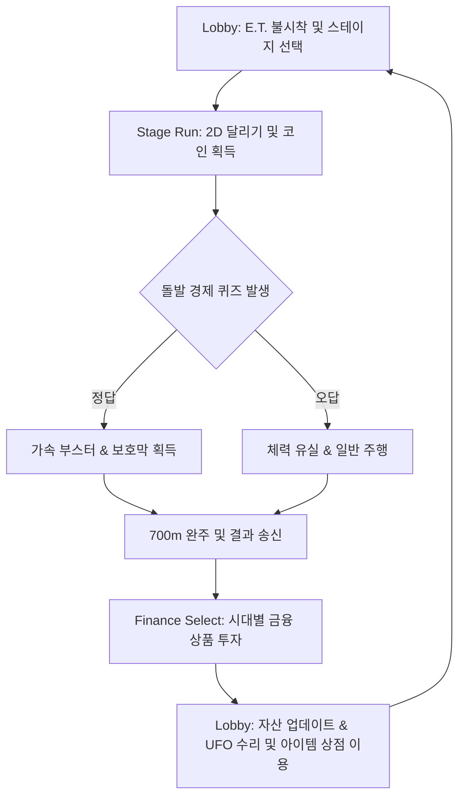

# 👽 자본주E.T. (Capitalist E.T.)

<p align="center">
  
</p>

<p align="center">
  <b>🏆 SSAFY 공통 프로젝트 핀테크 트랙 2등 수상 (우수상)</b>
</p>

> **"지구에 불시착한 외계인(E.T.), 시대별 경제 격변을 헤쳐나가며 UFO 수리 자금을 모아라!"**  
> **자본주E.T.**는 시대별 경제 이벤트와 금융 선택을 통과하며 미래의 자산 궤적을 직접 바꾸는 **스토리형 브라우저 2D 러너 게임 및 금융 학습 플랫폼**입니다.

<br />

## 📋 프로젝트 요약

| 항목 | 상세 정보 |
| :--- | :--- |
| **진행 기간** | 2026.02.16 ~ 2026.04.03 (약 7주) |
| **수상 내역** | **🏆 SSAFY 공통 프로젝트 핀테크 트랙 2등 수상 (우수상)** |
| **개요** | 플레이를 통해 실생활 금융/경제 개념을 자연스럽게 체득하는 2D 횡스크롤 러너 게임 |
| **팀 구성** | **4인 개발 프로젝트** (클라이언트 2명, 백엔드 1명, 인프라/클라이언트 1명) |
| **Tech Stack** | **FE**: Unity <br> **BE**: Spring Boot (Java 17) <br> **DB**: PostgreSQL, Redis <br> **Infra**: AWS EC2, Docker |
| **협업 툴** | **Jira**: 매주 스프린트 및 백로그 관리를 통해 마일스톤 및 일정 수립 <br> **Notion**: 회의록 누적, 기획 요구사항 정의서 서면 합의 및 프로젝트 자료 아카이빙 |

<br />

## 👥 팀원 소개 및 역할 분담 (R&R)

### 🎮 Client Developers (유니티 클라이언트)
* **진준영 (유니티 클라이언트 개발 - 본인)**
  * **인게임 클라이언트 핵심 플레이 시스템 및 물리 설계 총괄**:
    * `Rigidbody2D` 기반 플레이어 물리 연산 구현 및 정밀 지면 감지(`Raycast`)를 혼합한 1단/2단 점프 메커니즘 설계 (`player.cs`)
    * 1980년대(성장기), 2000년대(격변기), 2020년대(인플레이션기) 시대별 경제 흐름에 맞춘 3개 인게임 맵 주행 필드 설계 및 무한 러너 장애물 패턴 스포너 구현
    * 피격 시 충격 카메라 셰이크(Screen Shake) 효과 및 무적 프레임 기믹 구현을 통한 타격감 및 플레이 밸런싱
  * **인게임 퀴즈 시스템 & 동적 연출 구현**:
    * 경제 군인 오브젝트와의 트리거 충돌에 따른 시간 정지 및 퀴즈 UI 모달 전환 흐름 제어
    * 퀴즈 정답 판정 시 가속 부스터 및 쉴드(방어막) 이펙트 연출, 오답 판정 시 즉시 체력 하트(HP) 유실 기믹 구현
    * 주행 가속 속도에 동적으로 변조되는 오디오 가변 피치 모듈 설계(속도 비례 사운드 피치 가변 조절)로 청각적 속도감 극대화
  * **클라이언트-서버 REST API 통신 아키텍처 연동**:
    * Unity `UnityWebRequest`를 활용한 커스텀 HTTP 통신 모듈(`APIManager.cs`) 단독 설계
    * 로그인 세션 기반의 `runId` 발급, 인게임 코인 획득량, 주행 중 퀴즈 응답 로그 실시간 전송 및 데이터 정합성 보장
* **팀원 A (유니티 클라이언트 개발)**
  * **아웃게임 콘텐츠 및 UI 시스템 개발**:
    * 메인 로비(Lobby) 씬 구성 및 스테이지 선택 UI 설계 및 연출 구현
    * 주행 종료 후 번 자산을 활용한 적금/주식 가입 시뮬레이션 인터페이스 개발
    * 인게임 아이템 상점 거래 UI 및 UFO 부품 정비 업그레이드 판넬 연출 구현
    * 아웃게임 데이터의 REST API 통신 모듈 인터페이스 바인딩 연동

### ⚙️ Backend & Infrastructure Developers
* **팀원 B (백엔드 개발)**
  * **Spring Boot API 서버 구축 및 비즈니스 로직 설계**:
    * Spring Boot 3.5.11 기반 게임 세션 트랜잭션 처리용 REST API 설계 및 비즈니스 로직(Run, User, Shop 도메인) 구현
    * 한국산업은행(KDB) 금융 용어 공공데이터 CSV 파싱 배치 프로세서(`QuizDataLoader`) 및 동적 4지선다 객관식 퀴즈 생성 알고리즘 설계
    * PostgreSQL JPA 엔티티 관계 매핑 최적화 및 유저 데이터 무결성 보장
* **팀원 C (인프라 & 클라이언트 개발)**
  * **클라우드 인프라 구축 및 WebGL 플랫폼 배포 최적화**:
    * AWS EC2 클라우드 인프라 구축 및 Docker Compose 기반 PostgreSQL/Redis 데이터베이스 컨테이너 가상화 배포
    * WebGL 플랫폼용 커스텀 빌드 템플릿 환경 최적화 및 Unity WebGL 빌드-웹서버 네트워크 엔드포인트 연동
    * Redis를 활용한 게임 세션 캐싱 및 실시간 자산 순위(Leaderboard) 집계 연동

---

## 🌟 프로젝트 소개
본 프로젝트는 **Unity (클라이언트) + Spring Boot (백엔드) + React (포트폴리오 소개 페이지)**가 긴밀하게 연동된 풀스택 게임 프로젝트입니다.  
유저는 시대별(1980년대, 2000년대, 2020년대) 주행 스테이지에서 장애물을 피하며 코인을 모으고, 돌발적으로 등장하는 경제 퀴즈를 해결하며 금융 지식을 학습합니다. 주행 결과로 축적된 자산은 백엔드 데이터베이스에 실시간으로 연동되어, 자산 증식과 상점 구매, 그리고 궁극적인 목표인 **UFO 수리 자금** 마련으로 이어집니다.

---

## 🔄 핵심 플레이 루프 (Core Loop)



---

## 🎮 실제 플레이 화면 (Gameplay Showcase)

게임플레이 흐름과 서순(Sequence)에 맞추어 구성된 실제 구동 화면입니다. 아래의 **[보러가기]** 메뉴를 누르시면 큼직한 고화질 시연 화면이 펼쳐집니다!

<br />

<details>
<summary><b>🎬 [보러가기] 1. 로비 & 스테이지 선택 (Lobby & Stage Selection)</b></summary>
<br />

* E.T.가 지구에서 자산 관리 기초를 훈련하고, 시대별 금융 흐름으로 진입하는 로비 및 스테이지 화면입니다.

| 로비 (메인 화면) | 스테이지 선택 |
| :---: | :---: |
|  |  |

</details>

<br />

<details>
<summary><b>🎬 [보러가기] 2. 시대별 게임 주행 (Era Stages)</b></summary>
<br />

* 1980년대 경제 급성장기부터 2000년대 IT 닷컴버블 격변기, 2020년대 고인플레이션/고금리기까지 시대별 맥락이 설계된 2D 러너 맵을 주행합니다.

| 1980년대 (대한민국 급성장기) | 2000년대 (IT 정보화 & 닷컴버블기) |
| :---: | :---: |
|  |  |

| 2020년대 (팬데믹 & 고인플레이션기) |
| :---: |
|  |

</details>

<br />

<details>
<summary><b>🎬 [보러가기] 3. 인게임 기믹 & 이벤트 (In-Game Gimmicks & Events)</b></summary>
<br />

* 주행 중 장애물에 피격되면 카메라가 흔들리며 하트가 차감됩니다. 중간중간 등장하는 군인과 충돌하면 **돌발 퀴즈**가 열리며, 정답을 맞추면 가속 부스터와 방어막을 획득합니다.

| 장애물 피격 (카메라 셰이크) | 돌발 경제 퀴즈 등장 |
| :---: | :---: |
|  |  |

| 퀴즈 정답 시 보호막 & 속도 부스트 | 게임 오버 (체력 유실) |
| :---: | :---: |
|  |  |

</details>

<br />

<details>
<summary><b>🎬 [보러가기] 4. 자산 증식 & 정비 (Finance & Goal Achievement)</b></summary>
<br />

* 주행 종료 후 번 돈을 시기 적절한 금융 상품(적금/주식 등)에 가입해 굴리고, 상점에서 인게임 아이템을 사거나 우주선을 정비하여 탈출을 가속화합니다.

| 금융 상품 가입 & 자산 증식 결과 | 아이템 상점 구매 |
| :---: | :---: |
|  |  |

| UFO 정비 (최종 목표) |
| :---: |
|  |

</details>

---

## 🛠 기술 스택 (Tech Stack)

### Client (Unity)
- **Engine**: Unity (WebGL Build 지원)
- **Language**: C#
- **Key Concepts**: Object Pooling, State Pattern (Animator), Raycast Ground Detection, Dynamic Sound Pitch Modulator, Custom REST API Communication (`APIManager`)

### Backend (Spring Boot)
- **Framework**: Spring Boot 3.5.11
- **Language**: Java 17
- **Database**: PostgreSQL (주 저장소), Redis (세션 및 캐싱)
- **Security**: Spring Security (Session-based Auth), OAuth2 Resource Server, JWT
- **Build Tool**: Gradle 8.x
- **Documentation**: Swagger/OpenAPI 3 (Springdoc)

### Frontend Showcase
- **Framework**: React + Vite
- **Styling**: Modern Vanilla CSS (Sleek Glassmorphism & Responsive Design)
- **Icons**: Lucide React

---

## 📂 디렉토리 구조 (Directory Structure)

```text
zabonzooET/
├── Assets/                 # [Unity] 게임 클라이언트 에셋 및 C# 스크립트
│   ├── Scripts/            # 게임 핵심 로직, API 연동, 퀴즈 및 오디오 제어
│   ├── Sprites/            # 시대별 UI 및 캐릭터 스프라이트 리소스
│   ├── Scenes/             # Lobby, StageSelect, GameStage, FinanceSelect 등
│   └── WebGLTemplates/     # 브라우저 배포용 커스텀 WebGL 템플릿
├── src/                    # [Spring Boot] 백엔드 애플리케이션 소스
│   ├── main/
│   │   ├── java/com/ssafy/amagetdon/
│   │   │   ├── common/     # 글로벌 예외 처리, 웹 설정, 세션 인터셉터
│   │   │   └── domain/     # domain 도메인 핵심 비즈니스 로직 (User, Game, Quiz, Coin)
│   │   └── resources/      # application.yml 설정 및 초기 데이터 SQL
├── portfolio/              # [React] 프로젝트 소개 및 포트폴리오 웹페이지
│   ├── src/                # App.jsx 랜딩 페이지 컴포넌트 및 자산
│   └── package.json        # Node.js 의존성 관리
├── infra/                  # 배포 인프라 및 Docker Compose 환경 설정
└── build.gradle            # Gradle 빌드 스크립트
```

---

## 🚀 주요 기술적 도전 및 해결 (Technical Challenges)

### 1. KDB 공공데이터 기반 동적 퀴즈 생성기 (`QuizDataLoader.java`)
- **문제**: 게임 내 학습 효과를 위해 수많은 금융 용어 퀴즈가 필요했으나, 이를 DB에 수동으로 등록하는 것은 비효율적이었습니다.
- **해결**: 한국산업은행(KDB) 공공데이터 CSV 파일을 파싱하는 **자동 배치 로더**를 구현했습니다. 서버 기동 시 용어 설명문과 정답 단어를 추출하고, 다른 용어 풀에서 무작위로 3개의 오답을 섞어(Shuffle) **4지선다형 객관식 퀴즈를 동적으로 자동 생성**하는 아키텍처를 도입했습니다.

### 2. 게임 물리 및 연출 디테일링 (`player.cs`, `GameManager.cs`)
- **입체적 점프**: `Rigidbody2D`와 `Raycast` 지면 판단 기술을 혼합하여 매끄러운 1단 및 2단 점프 피드백을 완성했습니다.
- **가변 사운드 피치 구현**: 게임 플레이 중 가속도나 부스터 발동에 따른 주행 속도 변화에 맞춰, **달리는 발소리 오디오의 Pitch(재생 속도 및 높낮이)를 실시간 비례 연동**시켜 속도감을 청각적으로 극대화했습니다.

### 3. 보안성 중심의 인프라 격리 설계
- **무결성 유지**: 외부 노출 방지를 위해 `application.yml` 설정 파일 내부의 PostgreSQL, Redis 등의 인프라 계정 정보를 **환경 변수화(`${POSTGRES_PASSWORD}`)**하여 관리했습니다. 
- **.gitignore 최적화**: Unity 에디터 캐시(`Library/`, `Temp/`), 의존성 파일, 그리고 인프라 로컬 비밀 키 파일(`.env`)을 완벽하게 격리 설정하여 **GitHub Public 공유 시 발생할 수 있는 보안 및 저작권 침해 우려를 원천 차단**했습니다.
