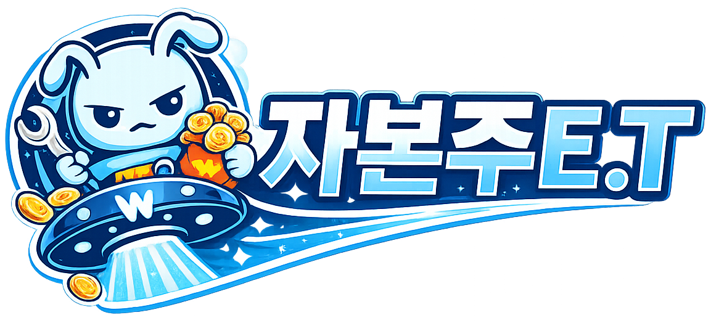
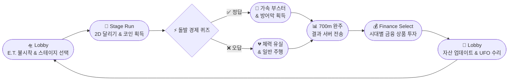
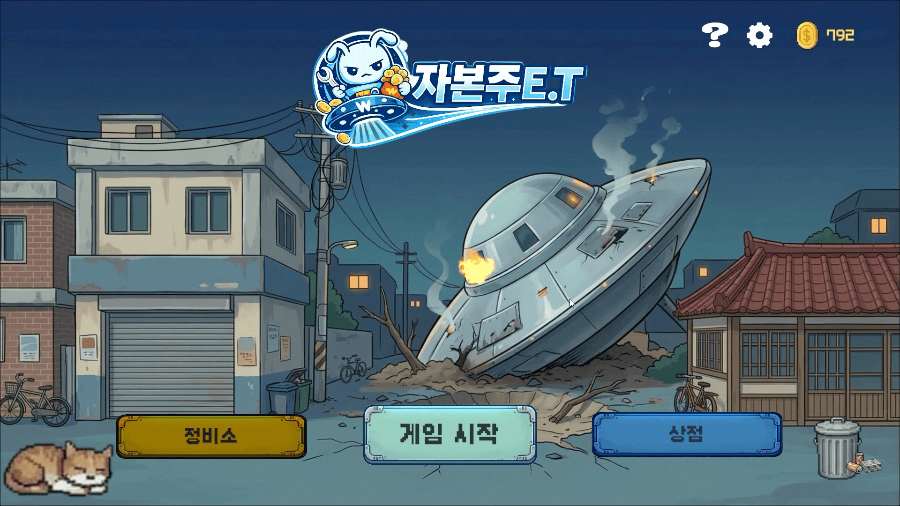
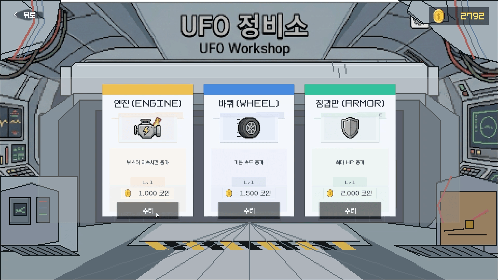

<div align="center">



<br/><br/>

<h2>🛸 &nbsp; 지구에 불시착한 외계인 E.T. &nbsp; 🛸</h2>
<h3>시대별 경제 격변을 헤쳐나가며 UFO 수리 자금을 모아라!</h3>

<br/>


&nbsp;

&nbsp;


<br/><br/>

Unity · Spring Boot · AWS 풀스택 **2D 러너 금융 학습 게임** &nbsp;|&nbsp; 시대별 경제 스테이지 주행 · 금융 퀴즈 · 자산 증식

<br/><br/>

---

🏆 &nbsp; **SSAFY 특화 프로젝트 핀테크 트랙** &nbsp; — &nbsp; 🥈 **우수상 2위**

---

</div>


## 🔄 &nbsp;핵심 플레이 루프



<br/>

---

## 🎮 &nbsp;실제 플레이 화면

> 게임플레이 흐름 순서대로 구성된 실제 구동 화면입니다. 클릭하면 펼쳐집니다!

<br/>

<details>
<summary><b>🎬 &nbsp;1. 로비 &amp; 스테이지 선택 (Lobby &amp; Stage Selection)</b></summary>
<br/>

> E.T.가 지구에 불시착하고, 시대별 금융 흐름의 스테이지로 진입하는 메인 화면입니다.

| 🛸 로비 (메인 화면) | 📋 스테이지 선택 |
| :---: | :---: |
|  |  |

</details>

<br/>

<details>
<summary><b>🎬 &nbsp;2. 시대별 게임 주행 (Era Stages)</b></summary>
<br/>

> 1980년대 경제 급성장기 → 2000년대 IT 닷컴버블 격변기 → 2020년대 고인플레이션기까지, 시대별 맥락이 설계된 2D 러너 맵을 주행합니다.

| 📼 1980년대 · 대한민국 급성장기 | 💻 2000년대 · IT 정보화 &amp; 닷컴버블기 |
| :---: | :---: |
|  |  |

| 📈 2020년대 · 팬데믹 &amp; 고인플레이션기 |
| :---: |
|  |

</details>

<br/>

<details>
<summary><b>🎬 &nbsp;3. 인게임 기믹 &amp; 이벤트 (In-Game Gimmicks &amp; Events)</b></summary>
<br/>

> 장애물 피격 시 카메라가 흔들리며 HP가 차감됩니다. 경제 군인과 충돌하면 **돌발 퀴즈**가 열리며, 정답 시 가속 부스터 & 방어막을 획득합니다.

| 💥 장애물 피격 (카메라 셰이크) | ❓ 돌발 경제 퀴즈 등장 |
| :---: | :---: |
|  |  |

| 🛡️ 퀴즈 정답 → 보호막 &amp; 속도 부스트 | 💀 게임 오버 (체력 유실) |
| :---: | :---: |
|  |  |

</details>

<br/>

<details>
<summary><b>🎬 &nbsp;4. 자산 증식 &amp; 정비 (Finance &amp; Goal Achievement)</b></summary>
<br/>

> 주행으로 번 자산을 금융 상품에 굴리고, 상점에서 아이템을 사거나 UFO를 정비하여 탈출을 가속화합니다.

| 💹 금융 상품 가입 &amp; 자산 증식 결과 | 🛒 아이템 상점 구매 |
| :---: | :---: |
|  |  |

| 🔧 UFO 정비 (최종 목표) |
| :---: |
|  |

</details>

<br/>

---

## 🛠️ &nbsp;기술 스택

<table>
  <tr>
    <th width="140">분류</th>
    <th>기술</th>
  </tr>
  <tr>
    <td align="center"><b>🎮 Client</b></td>
    <td>
      
      &nbsp;
      
      &nbsp; Object Pooling · Raycast Ground Detection · Dynamic Sound Pitch · Custom REST API (<code>APIManager.cs</code>)
    </td>
  </tr>
  <tr>
    <td align="center"><b>⚙️ Backend</b></td>
    <td>
      
      &nbsp;
      
      &nbsp;
      
      &nbsp; Spring Security · Session Auth · Swagger/OpenAPI 3
    </td>
  </tr>
  <tr>
    <td align="center"><b>🗄️ Database</b></td>
    <td>
      
      &nbsp;
      
      &nbsp; JPA · 세션 캐싱 · 실시간 리더보드
    </td>
  </tr>
  <tr>
    <td align="center"><b>☁️ Infra</b></td>
    <td>
      
      &nbsp;
      
      &nbsp;
      
      &nbsp; GitLab CI/CD · Let's Encrypt SSL
    </td>
  </tr>
  <tr>
    <td align="center"><b>🤝 협업</b></td>
    <td>
      
      &nbsp;
      
      &nbsp;
      
      &nbsp; 주간 스프린트 · 백로그 관리 · 회의록 아카이빙
    </td>
  </tr>
</table>

<br/>

---

## 📂 &nbsp;디렉토리 구조

```text
zabonzooET/
├── Assets/                       # 🎮 Unity 게임 클라이언트 에셋 & C# 스크립트
│   ├── Scripts/
│   │   ├── APIManager.cs         #   커스텀 HTTP 통신 모듈
│   │   ├── player.cs             #   플레이어 물리 & 점프 시스템
│   │   ├── GameManager.cs        #   인게임 전체 흐름 관리
│   │   ├── QuizManager.cs        #   퀴즈 UI 모달 & 판정 로직
│   │   ├── FinanceSelect/        #   금융 상품 선택 씬 스크립트
│   │   └── StageSelect/          #   스테이지 선택 씬 스크립트
│   ├── Scenes/                   #   Lobby · StageSelect · 1980s/2000s/2020s · FinanceSelect
│   ├── Sprites/                  #   시대별 캐릭터 & UI 스프라이트
│   └── WebGLTemplates/           #   브라우저 배포용 커스텀 WebGL 템플릿
│
├── src/main/java/                # ⚙️ Spring Boot 백엔드 소스
│   └── com/ssafy/amagetdon/
│       ├── common/               #   글로벌 예외처리 · 세션 인터셉터 · 웹 설정
│       └── domain/               #   User · Game · Quiz · Coin 도메인 비즈니스 로직
│
├── infra/                        # ☁️ 배포 인프라 설정
│   ├── docker-compose.prod.yml   #   프로덕션 컨테이너 구성
│   ├── nginx.conf                #   리버스 프록시 & 라우팅
│   └── scripts/                  #   EC2 초기화 · 배포 자동화 스크립트
│
├── portfolio/                    # 🌐 React 포트폴리오 소개 페이지
└── build.gradle                  # Gradle 빌드 스크립트
```

<br/>

---

## 🚀 &nbsp;주요 기술적 도전 및 해결

<br/>

### &nbsp;⚡ 1. KDB 공공데이터 기반 동적 퀴즈 자동 생성 &nbsp;`QuizDataLoader.java`

| | 내용 |
|---|---|
| **문제** | 금융 학습 효과를 위해 수백 개의 퀴즈가 필요했으나, DB 수동 등록은 비효율적 |
| **해결** | KDB 금융 용어 공공데이터 CSV를 파싱하는 **자동 배치 로더** 구현 |
| **방식** | 서버 기동 시 용어 설명문에서 정답을 추출하고, 전체 용어 풀에서 무작위 오답 3개를 Shuffle → **4지선다 객관식 퀴즈 동적 자동 생성** |

<br/>

### &nbsp;🎯 2. 게임 물리 & 연출 디테일링 &nbsp;`player.cs` · `GameManager.cs`

| | 내용 |
|---|---|
| **1단/2단 점프** | `Rigidbody2D` 물리 연산 + `Raycast` 지면 감지를 혼합하여 매끄러운 점프 피드백 구현 |
| **가변 사운드 피치** | 주행 속도 변화에 따라 달리기 오디오의 **Pitch를 실시간 비례 연동**, 청각적 속도감 극대화 |
| **카메라 셰이크** | 피격 시 화면 흔들림 + 무적 프레임 기믹으로 타격감 & 밸런싱 동시 해결 |

<br/>

### &nbsp;🔒 3. 보안성 중심의 인프라 격리 설계

| | 내용 |
|---|---|
| **환경 변수화** | `application.yml` 내 PostgreSQL · Redis 계정 정보를 모두 `${ENV_VAR}` 방식으로 외부화 |
| **.gitignore 최적화** | Unity 에디터 캐시(`Library/`, `Temp/`), 인프라 시크릿(`.env`) 완벽 격리 → Public 저장소 보안 사고 원천 차단 |

<br/>

---

## 👥 &nbsp;팀 구성 및 역할 분담

<table>
  <tr>
    <td align="center" width="25%">
      <a href="https://github.com/kkaemong">
        <br/><br/>
        <b>진준영</b><br/>
        <sub>🎮 Unity 클라이언트 · 본인</sub>
      </a><br/><br/>
      <sub>🕹️ 물리 점프 & 무한 러너 시스템</sub><br/>
      <sub>💬 퀴즈 모달 & 부스터/쉴드 연출</sub><br/>
      <sub>🔌 <code>APIManager.cs</code> HTTP 모듈 단독 설계</sub>
    </td>
    <td align="center" width="25%">
      <a href="#">
        <br/><br/>
        <b>경민지</b><br/>
        <sub>🎨 Unity 클라이언트</sub>
      </a><br/><br/>
      <sub>🗂️ 스테이지 선택 & 금융 상품 씬 구현</sub><br/>
      <sub>✏️ E.T. & 배경 2D 에셋 직접 드로잉</sub><br/>
      <sub>🖼️ 스프라이트 패킹 & UI 최적화</sub>
    </td>
    <td align="center" width="25%">
      <a href="#">
        <br/><br/>
        <b>홍정희</b><br/>
        <sub>⚙️ Spring Boot 백엔드</sub>
      </a><br/><br/>
      <sub>🛠️ 전 도메인 REST API 단독 구현</sub><br/>
      <sub>🧠 KDB 기반 4지선다 퀴즈 자동 생성</sub><br/>
      <sub>📦 Redis 캐싱 & 실시간 리더보드</sub>
    </td>
    <td align="center" width="25%">
      <a href="#">
        <br/><br/>
        <b>김대연</b><br/>
        <sub>☁️ 인프라 & Unity 클라이언트</sub>
      </a><br/><br/>
      <sub>🏠 로비 · 상점 · UFO 정비소 UI 구현</sub><br/>
      <sub>🚀 AWS EC2 + Docker Compose 배포</sub><br/>
      <sub>🌐 Nginx 리버스 프록시 & WebGL 최적화</sub>
    </td>
  </tr>
</table>

<br/>

---

<div align="center">

**자본주E.T.** · SSAFY 공통 프로젝트 2기 핀테크 트랙

</div>
